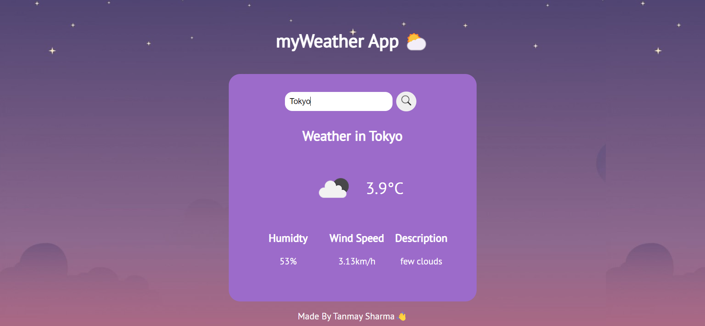

# myWeather-App

[](https://app.netlify.com/sites/ts-weatherapp/deploys)

This is a web app built using vanilla javascript that utilizes the OpenWeather API to retrieve weather data from various cities in the world.



## Project setup

These instructions will get you a copy of the project up and running on your local machine for development and testing purposes.

### Requirements

OpenWeather API Key

You need an API Key for the project to work. To get one go to [OpenWeather](https://openweathermap.org/), sign up and head to the [api](https://openweathermap.org/api) section to generate an api.

### Set Up

After cloning this project to your system all you need to do is create a JS file in the same folder by the name of config.js
and put your api key in that file as:

```
 var config = {
	API_KEY: 'YOUR_API_KEY'
	}
```

## Built With

- Vanilla JS
- [Open Weather Api](https://openweathermap.org/)

## Authors

- **Tanmay Sharma** - [tanmay](https://github.com/tanmay-s55) :v:

## License

This project is licensed under the MIT License - see the [LICENSE](LICENSE) file for details
